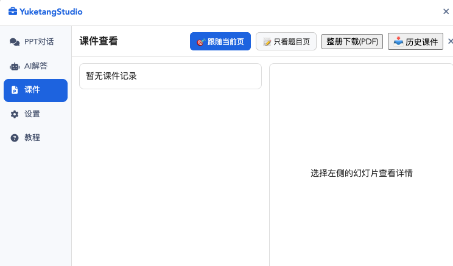
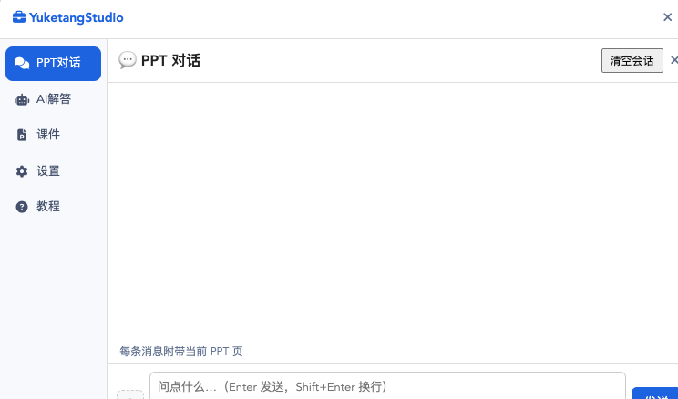
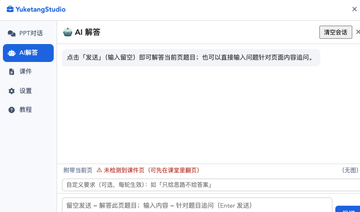
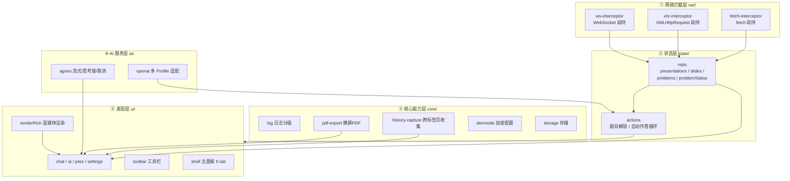
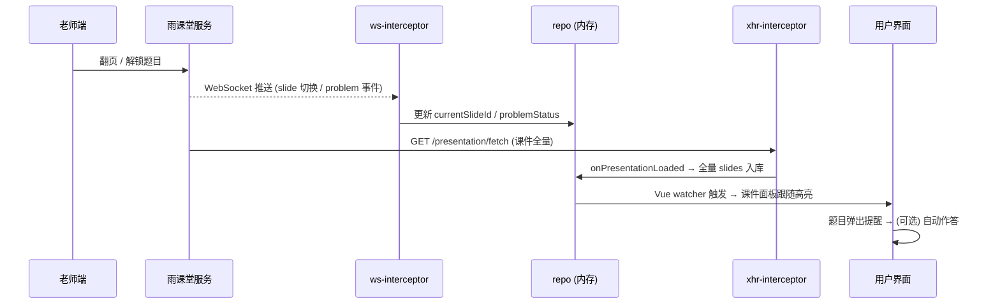
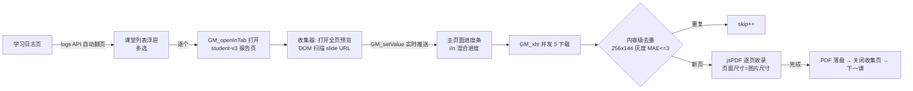
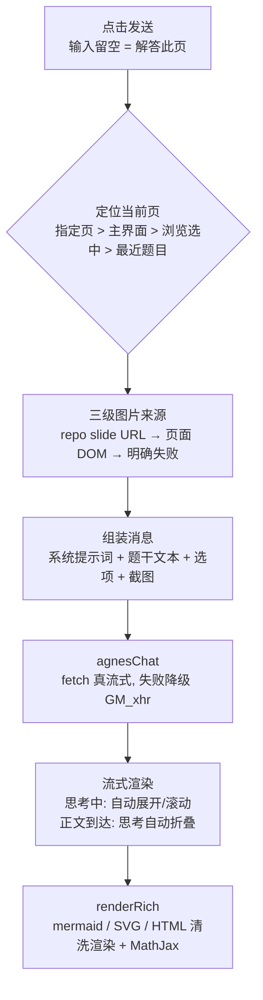

<div align="center">
  
  <h1>YuketangStudio</h1>
  <p><b>雨课堂学习增强助手</b> —— 让每一页课件都为你所用</p>
  <a href="https://github.com/RayMorTwinkle/YuketangStudio/blob/main/LICENSE"></a>
  
  
  
  <br/><br/>
  <a href="https://raw.githubusercontent.com/RayMorTwinkle/YuketangStudio/main/ykt-helper/dist/YuketangStudio-latest.user.js"><b>📥 点此一键安装</b></a>（需要先安装 <a href="https://www.tampermonkey.net/">篡改猴</a>）
</div>

---

## 🎒 上课时，它是你的隐形助教

想象一下这样的课堂：

> 老师正在讲 KMP 算法，你还在消化上一步的指针回退。突然屏幕弹出投票题，倒计时 2 分钟——

**别慌**。装了 YuketangStudio 的浏览器会自动为你做完这几件事：

- 🔔 **弹窗 + 提示音**提醒你"来题了"，摸鱼也不会错过
- 🤖 **AI 解答**已经把题干文本和课件截图一起发给 AI，思考过程实时展开，答案和解析直接送到你面前
- ✍️ 想自己答？点开 AI 对话，像聊天一样追问："为什么是 i 回到 5？"——AI 看着同一页课件跟你讨论

> 45 分钟后下课，你想把整本课件带走复习——

- 📑 **一键导出**：37 页幻灯片自动拼成横屏 PDF，页面比例和原图完全一致，零白边
- 🧹 老师回跳重讲的页面？**自动去重**，只保留一份
- 📚 之前上过的每一节课，都能从**历史课堂**里批量勾选、一次性全部下载

> 复习时对着课件还是看不懂？——

- 💬 在 **PPT 对话**里框选任何页面，让 AI 用**流程图、思维导图、表格、HTML 交互组件**重新讲一遍——AI 的回复里的 mermaid 图、公式、表格都会直接渲染出来，不是冷冰冰的代码

<div align="center">
  
  <p><i>课件面板：跟随当前页 · 只看题目页 · 整册下载 · 历史课件批量导入</i></p>
</div>

## 🧰 功能一览

| 功能 | 一句话介绍 |
|---|---|
| 🤖 **AI 解答** | 自动识别当前题目页，题干文本 + 课件截图一起发给 AI，一键出答案；支持多轮追问、流式输出、思考过程实时展开 |
| 💬 **PPT 对话** | 像聊天一样对任何一页课件连续提问；AI 会用 mermaid 流程图、表格、HTML 组件等可视化形式讲解 |
| 📑 **课件查看** | 实时同步课堂幻灯片；「跟随当前页」自动追着老师翻页；整册一键导出零白边 PDF |
| 📚 **历史课件归档** | 不上课也能把往期课堂课件批量勾选、一次性全部导出（内容级去重） |
| ➕ **附件系统** | 对话里随手添加多张 PPT 页面或本地图片一起问 AI |
| 🔔 **答题提醒** | 老师推题立刻弹窗 + 提示音，支持自定义提示音 |

<div align="center">
  
  <p><i>PPT 对话：左下 ＋ 可添加 PPT 页面/上传图片；AI 回复中的图表与公式直接渲染</i></p>
</div>

## 📦 安装（30 秒）

1. 给浏览器装上 [篡改猴 (Tampermonkey)](https://www.tampermonkey.net/) 扩展
2. 点这里 → **[📥 一键安装 YuketangStudio](https://raw.githubusercontent.com/RayMorTwinkle/YuketangStudio/main/ykt-helper/dist/YuketangStudio-latest.user.js)**，油猴会自动弹出安装界面，点「安装」
3. 打开雨课堂网页版，左下角出现工具栏就成功了

> 手动导入：下载 [`ykt-helper/dist/YuketangStudio-latest.user.js`](https://github.com/RayMorTwinkle/YuketangStudio/blob/main/ykt-helper/dist/YuketangStudio-latest.user.js)，在篡改猴「实用工具 → 导入」或新建脚本粘贴。
>
> 从源码构建：`git clone` → `cd ykt-helper` → `npm i` → `npm run check`（lint + 构建 + 测试一条龙）。

## 📖 使用教程

<div align="center">
  
  <p><i>AI 解答：底部状态行实时显示识别到的页面，留空发送即解答此页</i></p>
</div>

### 上课中

页面左下角工具栏三个按钮：**💼 主面板** / **🔔 习题提醒开关** / **✨ 自动作答开关**。

打开主面板后左侧切换 5 个功能页：

- **💬 PPT对话**：左下 ＋ 可添加 PPT 页面或上传图片；输入留空直接发送无效，输入问题即围绕当前课件追问；AI 回复中的 mermaid 图、公式、表格都会直接渲染
- **🤖 AI解答**：底部状态行显示当前识别到的页面；**输入留空点发送 = 解答此页题目**（自动附带题干文本与截图）；想追问就输入内容再发
- **📑 课件**：
  - 「🎯 跟随当前页」默认开启——选中项自动追着老师翻页；你手动点缩略图就会脱离，再点按钮恢复
  - 「📝 只看题目页」筛选出老师发过题的页面
  - 「整册下载(PDF)」永远导出全部页面，横屏零白边
- **⚙️ 设置**：AI 配置、自动作答参数、**提示词自定义**（两个功能的系统提示词都能改，一键恢复默认）、自定义提示音
- **❓ 教程**：面板内快速上手

### 下课后

**📑 课件 → 📥 历史课件**：勾选任意多节课（支持全选）→「⬇️ 下载选中」→ 喝口水，PDF 逐个自动生成。单节课失败不会中断整批，最后给出成功/失败汇总。

---

<a id="deep-dive"></a>
## 🏗 项目深度解读

> 以下内容面向想理解这个项目内部机制的读者：它如何工作、为什么这样设计、工程上做了哪些权衡。

### 整体架构

YuketangStudio 是一个运行在雨课堂页面上下文中的 Tampermonkey 用户脚本，整体分为五层：



**关键取舍**：页面数据不落库、不经过任何第三方服务器——所有课件/题目都活在页面内存 + `localStorage` + `GM_*` 存储里，AI 请求由用户自己的 API Key 直连模型厂商。

### 核心数据流之一：课堂实时同步



课件全量为什么走 XHR 拦截而不是主动调 API？因为 `presentation/fetch` 是**课堂内鉴权接口**，页面自己会请求一次——拦截这一次响应就能拿到整个 deck（含老师还没讲到的页），无需关心签名与时序。这是我们实测后从「逐页等待推送」改为「拦截全量 + WS 增量」的原因。

### 核心数据流之二：历史课件批量收集



两个容易踩的坑在这里被解决：其一，跨标签页进度用 `GM_addValueChangeListener` 推送而非轮询，快速下载时进度不丢帧；其二，「去重」与「下载失败」分开计数——用户看到的"去重 n 页"必须是可信的，否则去重功能本身就失去了意义。

### 核心数据流之三：AI 解答的一次请求



### 设计决策剖析（Q&A）

**Q1：为什么劫持原生 `WebSocket`/`XMLHttpRequest`，而不是直接轮询雨课堂的接口？**

雨课堂的题目推送、翻页事件走 WebSocket，课件数据走页面自身发起的 XHR。劫持原生构造函数意味着：① 与页面共享同一份鉴权与登录态，零额外认证代码；② 事件到达即处理，延迟与老师端操作一致；③ 不主动发请求，不增加服务器负担，行为上更"透明"。轮询方案会引入延迟、增加请求量，且轮询间隔内的推送可能丢失。

**Q2：导出 PDF 为什么让「页面尺寸跟随图片宽高比」，而不是统一 A4？**

雨课堂的课件图统一是 16:9 附近的横屏图，但历史页面里偶尔混入不同比例的图片。固定 A4 会出现两条必然的坏路径：横图被缩到一页里留下大片白边，或被裁切。让每页尺寸等于图片尺寸（pt 单位、原比例），PDF 阅读器里呈现的就是"无边框幻灯片"，观感与原始课件一致——这是 1.30.1 版本修了横屏参数之后进一步推导出的更彻底方案。

**Q3：内容级去重为什么最终选择「256×144 灰度 + 平均绝对差」，而不是 dHash 这类感知哈希？**

实测数据说话：文字密集型 PPT 页面上，dHash 对同页 JPEG 重压缩变体的汉明距离波动（7~11）与异页距离（14~22）区分度不足，阈值骑线。改为 256×144 缩略灰度图后，同页变体 MAE 落在 0.35~0.73，异页 7.5~12.5，**分离度 10.3 倍**，阈值取 3 时两侧都有充足余量。这不是拍脑袋选型，是采集真实 slide 样本校准的结果。

**Q4：AI 解答为什么坚持把「题干文本」和「截图」一起发给模型？**

课堂系统本身就推送了结构化的题干与选项（`problem.body/options`），这比让模型从截图里 OCR 题干可靠得多——截图可能被压缩、公式可能糊掉、选项字母可能被遮挡。让文本承担"精确信息"，让图片承担"图表与版面"，各取所长。这条比"多发一张图"重要得多：**上下文的质量决定回答的质量**。

**Q5：富媒体渲染为什么用「同步占位 + 异步后处理」两阶段，而不是在流式渲染里直接画？**

流式输出时，AI 的 mermaid/HTML 代码块可能还没写完，此刻渲染必然失败或闪烁；且 mermaid 渲染库（约 2MB）按需加载存在异步窗口。两阶段方案：流式阶段只做轻量 Markdown 转换 + 占位符；回复完成后 `renderRich` 统一执行 mermaid→SVG、DOMPurify 清洗、MathJax 排版。期间还有一个隐蔽竞态——挂起的 `requestAnimationFrame` 会在后处理完成后把 innerHTML 重置回未渲染状态——通过在完成路径显式取消挂起帧解决。

**Q6：渲染管线为什么最终换用 marked + DOMPurify，而不是继续维护手写解析器？**

AI 的输出格式无法穷举：mermaid 可能被包在 `<p>` 里、代码围栏可能缺失语言标记、HTML 与图表可能混排。手写解析器每遇到一种新格式就要打一个补丁，且这些补丁互相打架。切换到 marked（GFM 全兼容）+ DOMPurify（业界标准清洗）后，我们只负责两个扩展点：自定义 code renderer（把 mermaid/svg/html 转成占位符）与渲染前预处理（剥离 AI 误加的 HTML 包裹）。**把不确定的事情交给成熟组件，把精力留给确定的产品逻辑**。

**Q7：为什么所有面板共享一个「主面板」壳，而不是像早期版本那样多个独立弹窗？**

独立弹窗有三个问题：z-index 互相打架、小屏幕上无处安放、每个面板各自维护显隐逻辑。统一 shell 后：面板成为 tab 内容，宽高由壳统一约束（`min(760px, 100vw-48px)`），自适应只需写一处；面板间通信（选页事件、打开请求）都有了单一入口。

### 工程实践

- **版本号单一来源**：`userscript.meta.js` 与产物文件名都从 `package.json` 读取，发版只改一处
- **质量门禁**：`npm run check` = ESLint（0 警告基线）+ Rollup 构建 + 三组回归测试（加密解锁 / PDF 去重与统计 / 接口翻页与去重）
- **日志分级**：默认只输出警告与错误；`localStorage.setItem('yksDebug','1')` 后全量输出，排查问题不重装
- **可调试性设计**：关键失败路径（图片下载、导出统计、面板时序）都留有探针与显式用户提示，拒绝"静默降级到错误结果"

### 目录结构

```
YuketangStudio/
├── ykt-helper/              # 脚本源码（唯一源码目录）
│   ├── src/
│   │   ├── index.js         # 入口：挂载时序、拦截器、防打扰刷新
│   │   ├── ai/              # LLM 适配（agnes 流式/思考链、openai 多 Profile）
│   │   ├── capture/         # 截图兜底
│   │   ├── core/            # env / storage / log / pdf-export / history-capture
│   │   ├── net/             # WS / XHR / fetch 拦截
│   │   ├── state/           # repo（内存状态）与 actions（答题循环）
│   │   ├── tsm/             # 雨课堂业务（题目格式化、提交）
│   │   └── ui/              # 主面板壳、工具栏、slide-image 共享模块、各面板
│   ├── scripts/             # 构建辅助与测试（gen-devmode.example、test-*.mjs）
│   ├── rollup.config.mjs    # 版本注入 + 构建前置检查
│   └── dist/                # 构建产物（latest 随版本提交，README 安装地址）
├── static/                  # 图标与 README 截图
└── changelog.md
```

### 技术栈

Rollup（构建，`inlineDynamicImports` 单文件产物）· 原生 JS（无框架，直接操作页面 DOM）· WebCrypto（AES-256-GCM / PBKDF2）· jsPDF · marked + DOMPurify + mermaid + MathJax（均按需加载）· ESLint 10 flat config

---

## ⭐ 致谢

- [ZaytsevZY/yuketang-helper-auto](https://github.com/ZaytsevZY/yuketang-helper-auto) —— 本项目基于其代码重构发展而来，核心的 WS 拦截、答题流程源于该项目
- [hotwords123/yuketang-helper](https://github.com/hotwords123/yuketang-helper) —— 项目灵感来源

## ⚖️ 免责声明

- 本工具仅供个人学习参考，请独立思考完成学业
- AI 解答功能需调用 LLM API，可能产生费用；AI 可能出错，请自行核对
- 本项目不在任何服务器存储用户数据，仅将题目内容发送给你自己配置的 LLM API
