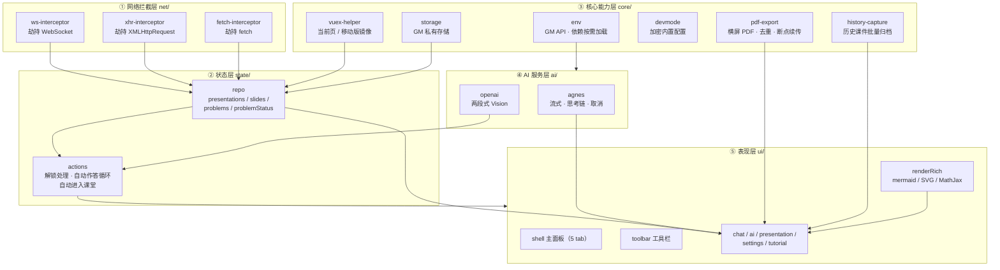
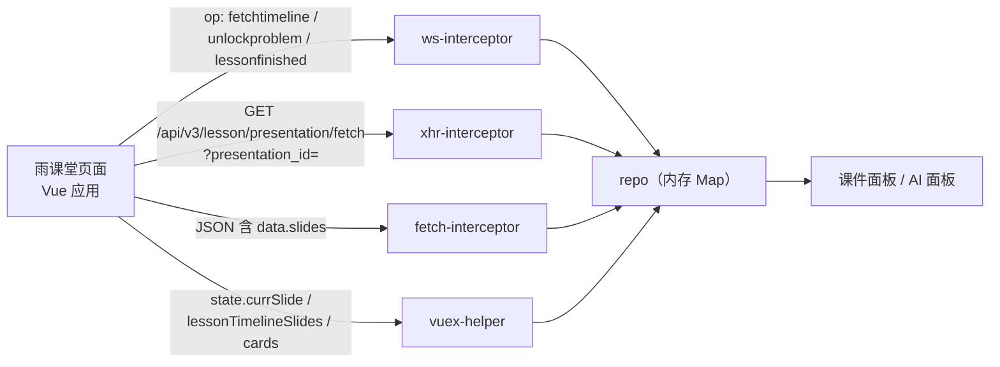
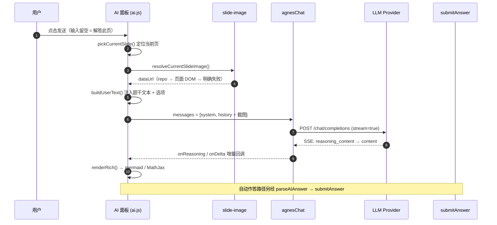
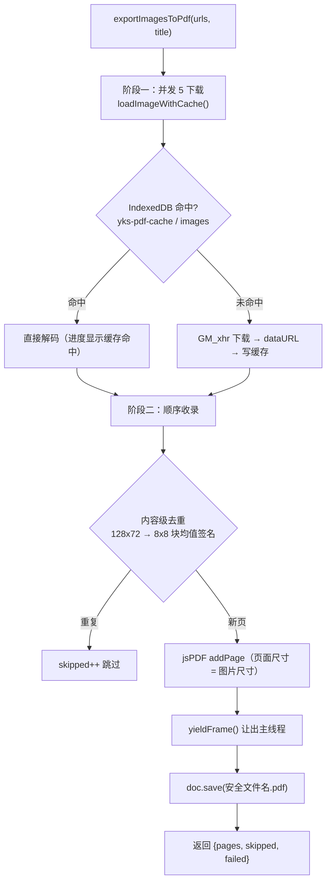
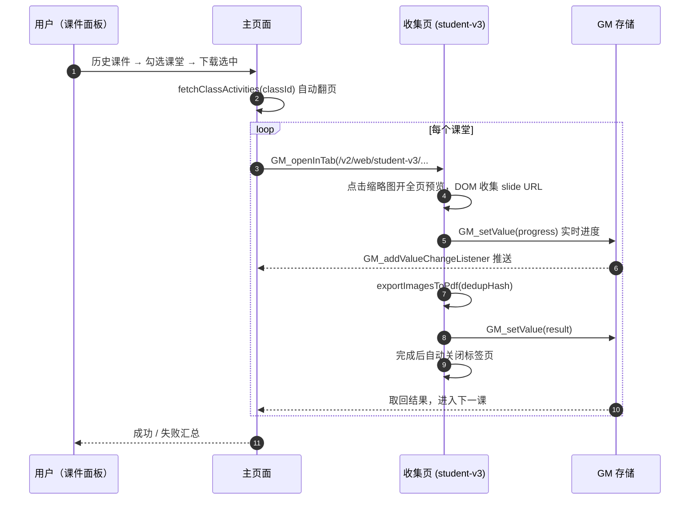

<div align="center">

> [English](./README_en.md) | **简体中文**


# YuketangStudio — 雨课堂学习增强助手

**题来了自动提醒，AI 看着课件替你解题；整册课件一键导出横屏零白边 PDF。**

把「跟不上翻页 / 课件存不下 / 题目答不出」这三件事，变成一个装进浏览器的小工具。


</div>

---

## 它解决什么问题

雨课堂原生的上课体验有三处硬伤：

1. **题目「来了才看见」**——老师推题时你正在看课件，提示一闪而过，倒计时已经开始。
2. **课件「看完就没了」**——课堂里的幻灯片不提供导出，想复习只能对着屏幕翻。
3. **AI 解题「没有上下文」**——直接问通用 AI，它看不到你这页课件、也不知道课堂系统下发的题干与选项。

**YuketangStudio 用一个 Tampermonkey 用户脚本把这三件事补齐**：拦截页面自身的 WebSocket 与 XHR 拿到课件与题目，配上你自己配置的 LLM，把「题干文本 + 课件截图」一起送给模型；再用 jsPDF 把整册幻灯片导出为比例与图片完全一致的横屏 PDF。

> **隐私承诺**：脚本不上传任何数据到第三方服务器。课件与题目只存在于页面内存、`GM_*` 私有存储和 IndexedDB 里；AI 请求由你的 API Key 直连你所配置的模型厂商。

---

## ✨ 功能

- 🔔 **答题提醒**：老师推题即时弹窗 + 提示音（可自定义），漏题不再发生
- 🤖 **AI 解答**：自动识别当前题目页，**题干文本（来自课堂系统）+ 课件截图**一起发给模型，流式输出、思考链实时展开、一键出答案
- 💬 **PPT 对话**：像聊天一样对任意一页课件连续追问；AI 回复里的 **mermaid 流程图 / 思维导图、SVG 示意图、HTML 片段、MathJax 公式**都会直接渲染
- ➕ **对话附件**：左下「＋」可选择多张 PPT 页面或上传本地图片，一起发给 AI
- 📑 **课件面板**：「跟随当前页」自动追着老师翻页；「只看题目页」筛选；「整册下载 (PDF)」横屏零白边
- 🗂 **历史课件归档**：从学习日志页多选往期课堂，脚本逐个打开收集页、内容级去重后批量导出 PDF，失败不中断
- 📱 **手机端适配**：窄屏下工具栏转纵向 40×40 触控按钮、面板 tab 移顶部；移动版页面内置「切桌面版」引导

---

## 🚀 快速开始

### 方式一：面向 AI Agent（一键安装，推荐）

把下面这段提示词直接发给你的本地 AI Agent（Claude Code / Codex / OpenCode …），它会自动完成安装：

````markdown
请帮我在本机浏览器安装 YuketangStudio（雨课堂学习增强助手，
GitHub: https://github.com/RayMorTwinkle/YuketangStudio）。
它是运行在雨课堂页面上的 Tampermonkey 用户脚本，提供习题提醒、
AI 解答、PPT 多轮对话、课件导出横屏 PDF、历史课件归档。

步骤：
1. 确认已安装「篡改猴 (Tampermonkey)」浏览器扩展：
   - 电脑 Chrome/Edge：从扩展商店安装；
   - 手机：推荐 Firefox 安卓版（官方支持篡改猴）。
2. 安装脚本（二选一）：
   - 直接打开安装地址，篡改猴会自动弹出安装页：
     https://raw.githubusercontent.com/RayMorTwinkle/YuketangStudio/main/ykt-helper/dist/YuketangStudio-latest.user.js
   - 或下载该 .user.js，在篡改猴面板「实用工具 → 从文件导入」。
3. 打开雨课堂（如 https://changjiang.yuketang.cn/v2/web/index）登录，
   页面左下角出现工具栏即为加载成功。
4. 在「设置」tab 配置一个 AI Profile（baseUrl / apiKey / model / visionModel），
   否则 AI 解答与 PPT 对话不可用；模型需支持图像输入 (Vision)。
5. 告诉我安装结果，并说明左下角工具栏三个按钮
   （主面板 / 习题提醒 / 自动作答）各自的用途。
````

### 方式二：面向人类用户

1. 安装浏览器扩展 [篡改猴 (Tampermonkey)](https://www.tampermonkey.net/)（Chrome / Edge 商店，或 Firefox 附加组件）。
2. 打开 **[📥 YuketangStudio-latest.user.js](https://raw.githubusercontent.com/RayMorTwinkle/YuketangStudio/main/ykt-helper/dist/YuketangStudio-latest.user.js)**，篡改猴自动弹出安装界面 → 点「安装」。
3. 打开雨课堂并登录，页面左下角出现工具栏即成功。

> **环境要求**：Chrome / Edge / Firefox（含安卓版）+ Tampermonkey。
> 脚本自身无需构建即可使用（安装地址指向已构建的 `dist/YuketangStudio-latest.user.js`）。
> 手机端需在浏览器里开启「请求桌面网站」（雨课堂服务端会依据 UA 把移动设备弹回功能受限的移动版）。

### 从源码构建

```bash
git clone https://github.com/RayMorTwinkle/YuketangStudio.git
cd YuketangStudio/ykt-helper
npm i
npm run check     # ESLint + Rollup 构建 + 回归测试
```

产物在 `ykt-helper/dist/`，其中 `YuketangStudio-latest.user.js` 始终指向最新构建。

---

## 🖥️ 使用

### 工具栏（页面左下角）

| 按钮 | 作用 |
|---|---|
| 💼 主面板 | 打开统一主面板（5 个 tab） |
| 🔔 习题提醒 | 开 / 关新题弹窗与提示音 |
| ✨ 自动作答 | 开 / 关自动作答（到点自动提交） |

### 主面板的 5 个 tab

| tab | 能做什么 |
|---|---|
| 💬 **PPT 对话** | 围绕当前课件多轮追问；「＋」可加 PPT 页 / 上传图片；回复支持图表与公式渲染 |
| 🤖 **AI 解答** | 底部状态行显示识别到的页面；**输入留空点发送 = 解答此页题目**（自动附带题干文本 + 截图），输入内容则围绕此页追问 |
| 📑 **课件** | 缩略图浏览；跟随当前页 / 只看题目页 / 整册下载 (PDF)；历史课件批量导入 |
| ⚙️ **设置** | AI Profile（多档）、自动作答参数、PPT 对话/AI 解答两套系统提示词（可改可恢复默认）、自定义提示音、开发者模式解锁 |
| ❓ **教程** | 面板内快速上手 |

### 三个典型工作流

**上课中**：装好后打开雨课堂即可。老师推题 → 弹窗提醒 → 打开主面板「AI 解答」→ 留空发送，AI 依据题干文本与截图给出答案与解释。

**下课后导出**：「课件」tab → 整册下载 (PDF) → 页面尺寸等于图片尺寸的横屏 PDF 自动落盘（重复页去重，价格上涨图会自动跳过并计数）。

**复习历史**：从课程的「学习日志」页打开「课件 → 历史课件」，勾选任意多节课 → 「⬇️ 下载选中」，脚本会逐课打开收集页并批量导出。

---

## 🏗️ 架构

YuketangStudio 是运行在雨课堂页面上下文里的 Tampermonkey 用户脚本，分为五层。

### 系统总览


```mermaid
flowchart TB
  subgraph NET["① 网络拦截层 net/"]
    WS["ws-interceptor<br/>劫持 WebSocket"]
    XHR["xhr-interceptor<br/>劫持 XMLHttpRequest"]
    FETCH["fetch-interceptor<br/>劫持 fetch"]
  end
  subgraph STATE["② 状态层 state/"]
    REPO["repo<br/>presentations / slides /<br/>problems / problemStatus"]
    ACT["actions<br/>解锁处理 · 自动作答循环<br/>自动进入课堂"]
  end
  subgraph CORE["③ 核心能力层 core/"]
    ENV["env<br/>GM API · 依赖按需加载"]
    PDF["pdf-export<br/>横屏 PDF · 去重 · 断点续传"]
    HIST["history-capture<br/>历史课件批量归档"]
    DEV["devmode<br/>加密内置配置"]
    ST["storage<br/>GM 私有存储"]
    VX["vuex-helper<br/>当前页 / 移动版镜像"]
  end
  subgraph AI["④ AI 服务层 ai/"]
    AG["agnes<br/>流式 · 思考链 · 取消"]
    OAI["openai<br/>两段式 Vision"]
  end
  subgraph UI["⑤ 表现层 ui/"]
    SHELL["shell 主面板（5 tab）"]
    TB["toolbar 工具栏"]
    PANELS["chat / ai / presentation /<br/>settings / tutorial"]
    RICH["renderRich<br/>mermaid / SVG / MathJax"]
  end
  WS --> REPO
  XHR --> REPO
  FETCH --> REPO
  VX --> REPO
  REPO --> ACT
  ACT --> UI
  REPO --> PANELS
  AG --> PANELS
  OAI --> ACT
  PDF --> PANELS
  HIST --> PANELS
  RICH --> PANELS
  ENV --> AI
  ST --> REPO
```

### 数据注入与获取（为什么不需要主动调 API）

脚本不主动请求雨课堂私有接口——它**劫持页面自身发起的通信**，共享同一份登录态与鉴权，事件到达即处理，且不增加服务器负担。


```mermaid
flowchart LR
  YKT["雨课堂页面<br/>Vue 应用"]
  WS["ws-interceptor"]
  XHR["xhr-interceptor"]
  FETCH["fetch-interceptor"]
  VX["vuex-helper"]
  REPO["repo（内存 Map）"]
  UI["课件面板 / AI 面板"]

  YKT -- "op: fetchtimeline /<br/>unlockproblem / lessonfinished" --> WS
  YKT -- "GET /api/v3/lesson/presentation/fetch<br/>?presentation_id=" --> XHR
  YKT -- "JSON 含 data.slides" --> FETCH
  YKT -- "state.currSlide /<br/>lessonTimelineSlides / cards" --> VX
  WS --> REPO
  XHR --> REPO
  FETCH --> REPO
  VX --> REPO
  REPO --> UI
```

### AI 解答的一次请求（时序）


```mermaid
sequenceDiagram
  autonumber
  participant U as 用户
  participant P as AI 面板 (ai.js)
  participant S as slide-image
  participant A as agnesChat
  participant M as LLM Provider
  participant T as submitAnswer
  U->>P: 点击发送（输入留空 = 解答此页）
  P->>P: pickCurrentSlide() 定位当前页
  P->>S: resolveCurrentSlideImage()
  S-->>P: dataUrl（repo → 页面 DOM → 明确失败）
  P->>P: buildUserText() 注入题干文本 + 选项
  P->>A: messages = [system, history + 截图]
  A->>M: POST /chat/completions (stream=true)
  M-->>A: SSE: reasoning_content → content
  A-->>P: onReasoning / onDelta 增量回调
  P->>P: renderRich() → mermaid / MathJax
  Note over P,T: 自动作答路径另经 parseAIAnswer → submitAnswer
```

### 整册导出 PDF 流程


```mermaid
flowchart TB
  A["exportImagesToPdf(urls, title)"] --> B["阶段一：并发 5 下载<br/>loadImageWithCache()"]
  B --> C{"IndexedDB 命中?<br/>yks-pdf-cache / images"}
  C -- 命中 --> D["直接解码（进度显示缓存命中）"]
  C -- 未命中 --> E["GM_xhr 下载 → dataURL → 写缓存"]
  D --> F["阶段二：顺序收录"]
  E --> F
  F --> G{"内容级去重<br/>128x72 → 8x8 块均值签名"}
  G -- 重复 --> H["skipped++ 跳过"]
  G -- 新页 --> I["jsPDF addPage（页面尺寸 = 图片尺寸）"]
  I --> J["yieldFrame() 让出主线程"]
  J --> K["doc.save(安全文件名.pdf)"]
  K --> L["返回 {pages, skipped, failed}"]
```

### 历史课件批量收集（时序）


```mermaid
sequenceDiagram
  autonumber
  participant U as 用户（课件面板）
  participant M as 主页面
  participant C as 收集页 (student-v3)
  participant S as GM 存储
  U->>M: 历史课件 → 勾选课堂 → 下载选中
  M->>M: fetchClassActivities(classId) 自动翻页
  loop 每个课堂
    M->>C: GM_openInTab(/v2/web/student-v3/...#yks-collect-runId)
    C->>C: 点击缩略图开全页预览，DOM 收集 slide URL
    C->>S: GM_setValue(progress) 实时进度
    S-->>M: GM_addValueChangeListener 推送
    C->>C: exportImagesToPdf(dedupHash)
    C->>S: GM_setValue(result)
    C->>C: 完成后自动关闭标签页
    S-->>M: 取回结果，进入下一课
  end
  M-->>U: 成功 / 失败汇总
```

---

## 📂 目录结构

```text
YuketangStudio/
├── ykt-helper/                  # 脚本源码（唯一源码目录）
│   ├── src/
│   │   ├── index.js             # 入口：挂载时序、拦截器安装、防僵尸刷新
│   │   ├── ai/                  # LLM 适配
│   │   │   ├── agnes.js         # OpenAI 兼容流式（思考链/取消/降级）
│   │   │   ├── openai.js        # 两段式 Vision（结构抽取 + 纯文本解题）
│   │   │   ├── kimi.js          # Kimi 直连（历史保留）
│   │   │   ├── deepseek.js      # DeepSeek 直连（备用）
│   │   │   └── gemini.js / openrouter.js   # 占位（未实现）
│   │   ├── capture/             # 截图兜底 screenshoot.js
│   │   ├── core/                # env / storage / log / types / pdf-export /
│   │   │                        # history-capture / devmode / idb-cache / vuex-helper
│   │   ├── net/                 # ws / xhr / fetch 三种拦截器
│   │   ├── state/               # repo（内存状态）· actions（答题/进课堂）
│   │   ├── tsm/                 # ai-format（Prompt/解析）· answer（提交）
│   │   └── ui/                  # shell / toolbar / toast / ui-api / slide-image / panels/
│   ├── scripts/                 # 构建辅助与回归测试
│   ├── rollup.config.mjs        # 版本注入 + 构建前置检查
│   ├── userscript.meta.js       # @match / @grant 元数据（版本号来自 package.json）
│   └── dist/                    # 构建产物（latest 随版本提交，即 README 安装地址）
├── static/                      # 图标与 README 截图
├── assets/                      # README 头图 logo
├── docs/spec/                   # 设计/修复规格（spec-001 ~ spec-004）
├── CODE_WIKI.md                 # 早期版本代码百科（部分内容为旧版命名，以 src 为准）
├── LICENSE                      # MIT + 使用条款
└── changelog.md
```

---

## 🔧 技术细节

**运行形态。** 不是 Chrome 扩展，而是单文件 Tampermonkey 用户脚本：`@run-at document-start`，用 `@grant` 取得 `GM_notification` / `GM_xmlhttpRequest` / `GM_openInTab` / `GM_getValue` / `GM_setValue` / `GM_addValueChangeListener` / `unsafeWindow` 等能力，由 Rollup 打包成 `iife`（`inlineDynamicImports: true`）产物 `dist/YuketangStudio-0.3.1.user.js`。

**匹配的雨课堂域名/版本**（见 `userscript.meta.js`）：`pro.yuketang.cn`、`changjiang.yuketang.cn`、`www.yuketang.cn` 及其它 `*.yuketang.cn`，覆盖桌面版 `/web/`、`/v2/web/*`、`/lesson/fullscreen/v3/*`、报告页 `student-lesson-report` / `student-v3`，以及移动版 `/m/v2/*`、`/m/*`。页面前端为 Vue 应用，故有桌面版与移动版两套 store 形状。

**PPT 数据怎么拿到。** 三条链路互补：
- **XHR 拦截** `GET /api/v3/lesson/presentation/fetch?presentation_id=` → `actions.onPresentationLoaded()` 全量入库（含老师还没讲到的页）；
- **fetch 拦截** 从 JSON 的 `data.slides` 补齐 `repo.slides`；
- **WS 拦截** 解析 `op`：`fetchtimeline` → 时间线题目、`unlockproblem` → 新题解锁、`lessonfinished` → 下课。
移动版课堂页/实时课堂抓不到 XHR 课件数据，改由 `syncMobileSlidesIntoRepo()` 每 4s 镜像 Vuex 的 `state.lessonTimelineSlides` / `state.cards`。

**竞态处理。** `unlockproblem` 可能早于课件 XHR 到达：此时事件进入 `repo.pendingUnlocks` 暂存，课件到达后重放（最多 3 次、每 3s 一轮），避免因时序丢题。

**AI 解答的两种调用。**
- **PPT 对话 / 追问** 走 `agnesChat()`：OpenAI 兼容 `/chat/completions`、真流式（SSE）、解析 `reasoning_content` 思考链、`AbortController` 可取消；`fetch` 因 CORS 失败时自动降级到 `GM_xmlhttpRequest` 伪流式。
- **题目解答** 走 `queryAIVision()` 两段式 pipeline：Step1 用 Vision 模型把截图抽成结构化 JSON（`question_type` / `stem` / `options` / `image_facts` / `requires_image_for_solution`），Step2 让文本模型据此解题；任一步失败或模型声明「必须看图」则回退到单步 Vision。

**AI Provider。** 通过「AI Profile」多档管理，内置预设：LongCat（Flash / Omni / Thinking）、Kimi（`moonshot-v1-8k` / vision-preview）、OpenAI（`gpt-4o-mini` / `gpt-4o`）、DeepSeek（`deepseek-chat`）；也可填任意 OpenAI 兼容端点（`makeChatUrl` 会自适应补 `/v1/chat/completions`）。

**密钥与存储安全。** 配置、API Key 优先存 `GM_getValue/GM_setValue`（前缀 `ykt-helper:`，页面脚本不可见），GM 不可用时退回 `localStorage` 并自动迁移、清除明文副本。开发者模式可解锁一份内置 LLM 配置，密文用 **AES-256-GCM**，密钥由密码经 **PBKDF2 (SHA-256)** 派生（见 `core/devmode.js`，密文 blob 为生成产物）。

**PDF 导出（`core/pdf-export.js`）。** 关键设计：
- **页面尺寸 = 图片尺寸**（`jsPDF({ unit: 'pt', format: [w,h], orientation })`），横图出横页、零白边；
- **并发 5** 下载，`GM_xhr` 绕开 OSS 的 CORS，图片转 dataURL；
- **内容级去重**：`128×72` 缩略灰度 → `8×8` 块均值签名（`Uint32` 隔点采样，仅在沙箱里做约 1 万次逐元素操作），精确匹配去重；`skipped`（重复）与 `failed`（失败）**分开计数**，让「去重 n 页」可信；
- **断点续传**：dataURL 落 IndexedDB（DB `yks-pdf-cache` / store `images`，key 为去掉 `?token` 的图片 path），刷新/中断后重导可命中缓存；
- **不冻结主线程**：阶段二同步编码循环用 `MessageChannel` 让出（后台标签页里 `setTimeout` 会被节流），并支持取消与 45s 停滞看门狗提示。

**答题提交（`tsm/answer.js`）。** `POST /api/v3/lesson/problem/answer` 正常作答；超过服务端截止时间则改走 `POST /api/v3/lesson/problem/retry` 补交。截止判定基于服务端时钟——`unlockproblem` 里的 `dt` 与本地时间之差记为 `clockOffset`，过期判断统一换算回服务端时间轴。答案解析由 `parseAIAnswer()` 按题型处理（单选/投票取字母、多选顿号/逗号拆分、填空按逗号分空、主观保留全文），并对 `STATE: NO_PROMPT` 哨兵判定为「无题目」而不提交。

**题目类型码**（`core/types.js`）：`1` 单选、`2` 多选、`3` 投票、`4` 填空、`5` 主观。

**富媒体渲染（`ui/panels/ai.js`）。** 采用「流式占位 + 完成后后处理」两阶段：流式阶段用 `marked` 做 GFM 解析，把 `mermaid` / `svg` / `html` 代码块转成占位 `div`；回复结束后 `renderRich()` 再统一执行 mermaid→SVG、DOMPurify 清洗、MathJax 排版。mermaid/marked/DOMPurify 均按需从 CDN 拉取并预热。

**历史课件收集（`core/history-capture.js`）。** 课堂列表来自 `/v2/api/web/logs/learn/<classId>?actype=-1&page=&offset=50&sort=-1` 自动翻页（筛 `type===14`，上限 1000 条，排除进行中的课堂）。收集页须带 `#yks-collect-<runId>` hash 标记才会自动运行——避免用户手动浏览报告页时被劫持点击/下载/关页；进度经 `GM_setValue` + `GM_addValueChangeListener` 跨标签实时推送（不可用时退化为 1s 轮询），超时保护为 **120s 无进展** 与 **15min 绝对上限**。

**日志分级（`core/log.js`）。** 默认只输出 `warn` / `error`；在控制台执行 `localStorage.setItem('yksDebug','1')` 后刷新即可全量输出（`log.enable()/disable()` 亦可运行时切换）。

**构建与质量门禁。** `npm run check` = ESLint（flat config）+ Rollup 构建 + 回归测试；版本号单一来源（`package.json` → `userscript.meta.js` 与产物文件名）。回归测试含 PDF 去重（`scripts/test-pdf-dedup.mjs`）与课堂列表翻页（`scripts/test-activities-paging.mjs`）；开发者模式端到端用例 `scripts/test-devmode.mjs` 因含解锁码未入库，全新克隆后 `npm test` 可能因缺该文件而失败（**待确认**，可单独运行其余用例）。构建前置检查会校验生成的 `src/core/devmode-blob.js` 是否存在，缺失时给出 `node scripts/gen-devmode.js` 指引。

---

## ❓ 常见问题

**Q：需要 Chrome 扩展吗？还是篡改猴就行？**
A：只装篡改猴（Tampermonkey）即可，脚本是用户脚本而非独立扩展。

**Q：手机能用吗？**
A：可以，推荐 **Firefox 安卓版**（官方支持篡改猴）。雨课堂服务端会按 UA 把移动设备弹回功能受限的移动版（`/m/v2`），需在浏览器里开启「请求桌面网站」。**Edge 安卓的桌面模式不修改 `Sec-CH-UA-Mobile` 请求头**，可能仍被弹回——此时脚本会弹出黄色引导条建议改用 Firefox。

**Q：AI 功能收费吗？**
A：脚本本身免费且不上传数据；AI 解答与 PPT 对话需调用你自己的 LLM API，费用由对应厂商计收。请自行核对 AI 答案。

**Q：会不会丢课件 / 丢题？**
A：课件与题目按课程分组存在浏览器本地（`GM_*` / `localStorage`），每门课默认保留最近 `maxPresentations`（默认 5）份课件。历史收集页在无进展 120s 或总时长 15min 后判定失败，避免无限等待。

**Q：为什么导出的 PDF 每页尺寸不一样？**
A：这是刻意的——页面尺寸等于原图尺寸，横图出横页，观感等同无边框幻灯片。若混入异比例图片也不会被裁切或留白。

---

## ⚠️ 注意事项

- **数据在本地**：脚本直接读写雨课堂页面上下文与浏览器本地存储；雨课堂前端升级可能改变页面结构或存储格式，届时适配逻辑需同步更新。
- **自动作答**：默认关闭。开启后会在设定延时（默认基础 3s + 随机 0–2s）后自动提交 AI 答案——**AI 可能出错**，请自行核对；未配置 API Key 时默认跳过（「宁缺答不误答」）。使用自动功能造成的后果由使用者承担。
- **学术诚信**：本工具仅供个人学习参考，请独立思考完成学业，勿用于考试作弊等学术不端场景（见 LICENSE 使用条款）。
- **隐私**：API Key 存于浏览器本地；题目内容仅在你主动触发 AI 时发送给你配置的模型厂商，脚本不经过任何中间服务器。
- **CDN 依赖**：富媒体渲染与 jsPDF/MathJax 需从 CDN 加载，离线环境相关能力不可用。

---

## 📄 License

本项目以 **MIT** 协议开放（见 [LICENSE](./LICENSE)，文件内含额外的使用条款与免责声明）。仓库未声明独立版权人信息，如需二次分发请保留原许可与声明。

---

## 🙏 致谢 / Credits

- [ZaytsevZY/yuketang-helper-auto](https://github.com/ZaytsevZY/yuketang-helper-auto) —— 本项目基于其代码重构发展而来，核心的 WebSocket 拦截与答题流程源自该项目。
- [hotwords123/yuketang-helper](https://github.com/hotwords123/yuketang-helper) —— 项目灵感来源。
- 运行时依赖：jsPDF、MathJax、marked、DOMPurify、mermaid（均按需加载）。
- 本仓库的图标、README（中英双语）与架构图为本项目重制。

---

<div align="center">
<sub>YuketangStudio · 让每一页课件都为你所用</sub>
</div>
