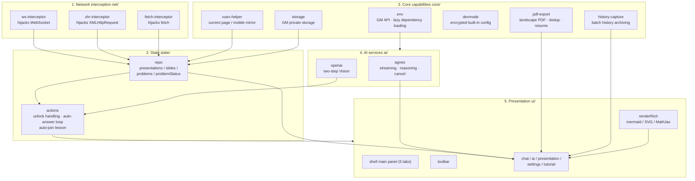
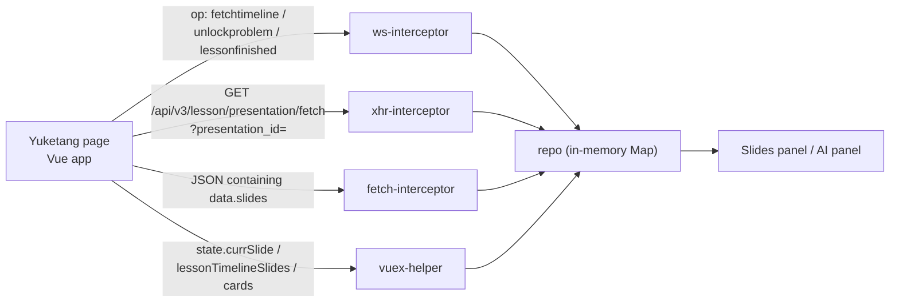
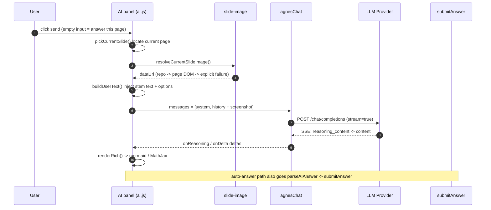
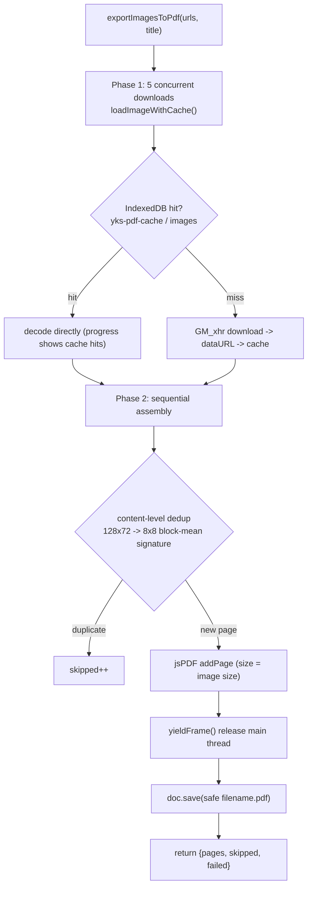
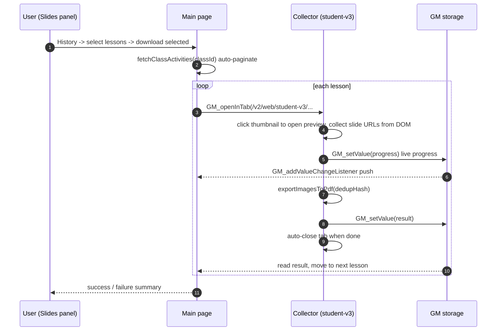

<div align="center">

> **English** | [简体中文](./README.md)


# YuketangStudio — a study enhancer for Yuketang (雨课堂)

**Get alerted the moment a question drops, let AI solve it while looking at the slides, and export a full deck to an edge-to-edge landscape PDF with one click.**

Three classroom pains — falling behind on page turns, slides you can't keep, questions you can't answer — collapsed into one small script that lives in your browser.


</div>

---

## Why it exists

Yuketang's native classroom experience has three rough edges:

1. **Questions appear "only when they appear"** — a question pops up while you are reading slides, the toast flashes by, and the countdown is already running.
2. **Slides are gone once class ends** — there is no export for the in-class deck, so revision means staring at the screen.
3. **General-purpose AI has no context** — it can't see your current slide, nor the structured stem/options that the classroom system already pushed to the page.

**YuketangStudio fills these gaps with a single Tampermonkey userscript**: it hooks the page's own WebSocket and XHR traffic to capture slides and problems, pairs them with your own LLM, and sends **the stem text plus a slide screenshot** to the model. It then uses jsPDF to export the whole deck as a landscape PDF whose page size exactly matches each image.

> **Privacy promise**: the script uploads nothing to any third-party server. Slides and problems live only in page memory, `GM_*` private storage and IndexedDB; AI requests go directly from your API key to the provider you configured.

---

## ✨ Features

- 🔔 **Question alerts**: instant popup + sound (customizable) the moment a question is released
- 🤖 **AI answers**: auto-detects the current question page and sends **stem text (from the classroom system) + a slide screenshot** together; streaming output, a live expandable reasoning chain, one click to answer
- 💬 **PPT chat**: chat with any slide across turns; AI replies render **mermaid flowcharts / mind maps, SVG diagrams, HTML snippets and MathJax formulas** inline
- ➕ **Chat attachments**: the lower-left "＋" lets you attach multiple PPT pages or upload local images for the AI
- 📑 **Slides panel**: "follow current page" tracks the teacher's page turns; "problems only" filter; "download full deck (PDF)" with landscape, edge-to-edge pages
- 🗂 **History archiver**: multi-select past lessons from the learning-log page; the script opens each collector tab, de-duplicates by content, and batch-exports PDFs without aborting on a single failure
- 📱 **Mobile support**: on narrow screens the toolbar becomes 40×40 vertical touch buttons and tabs move to the top; mobile pages show a built-in "switch to desktop" guide

---

## 🚀 Quick Start

### Option 1: For AI Agents (one-prompt install, recommended)

Paste the block below to your local AI agent (Claude Code / Codex / OpenCode …) and it will handle the install:

````markdown
Please install YuketangStudio (a study enhancer for Yuketang / 雨课堂,
GitHub: https://github.com/RayMorTwinkle/YuketangStudio) in my browser.
It is a Tampermonkey userscript that runs on Yuketang pages and provides
question alerts, AI answers, PPT multi-turn chat, landscape PDF export
of slides, and history archiving.

Steps:
1. Make sure the Tampermonkey extension is installed:
   - Desktop Chrome/Edge: install from the extension store;
   - Mobile: Firefox for Android is recommended (officially supports Tampermonkey).
2. Install the script (either way):
   - Open the install URL directly and Tampermonkey will prompt automatically:
     https://raw.githubusercontent.com/RayMorTwinkle/YuketangStudio/main/ykt-helper/dist/YuketangStudio-latest.user.js
   - Or download the .user.js and use Tampermonkey's
     "Utilities → Import from file".
3. Open Yuketang (e.g. https://changjiang.yuketang.cn/v2/web/index) and log in.
   A toolbar in the bottom-left corner means it loaded successfully.
4. In the "Settings" tab, configure an AI Profile
   (baseUrl / apiKey / model / visionModel); otherwise AI answers and
   PPT chat are unavailable. The model must support image input (Vision).
5. Report the install result, and explain the three toolbar buttons
   (main panel / question alerts / auto-answer).
````

### Option 2: For humans

1. Install the [Tampermonkey](https://www.tampermonkey.net/) extension (Chrome / Edge store, or Firefox add-ons).
2. Open **[📥 YuketangStudio-latest.user.js](https://raw.githubusercontent.com/RayMorTwinkle/YuketangStudio/main/ykt-helper/dist/YuketangStudio-latest.user.js)**; Tampermonkey shows its install screen → click "Install".
3. Open Yuketang and log in — a toolbar appears in the bottom-left corner when it works.

> **Requirements**: Chrome / Edge / Firefox (incl. Android) + Tampermonkey.
> No build is needed to use the script (the install URL points to the prebuilt `dist/YuketangStudio-latest.user.js`).
> On mobile you must enable "Request desktop site" (Yuketang's server redirects mobile devices to the feature-limited mobile frontend based on the user agent).

### Build from source

```bash
git clone https://github.com/RayMorTwinkle/YuketangStudio.git
cd YuketangStudio/ykt-helper
npm i
npm run check     # ESLint + Rollup build + regression tests
```

Outputs go to `ykt-helper/dist/`, where `YuketangStudio-latest.user.js` always points to the newest build.

---

## 🖥️ Usage

### Toolbar (bottom-left of the page)

| Button | Purpose |
|---|---|
| 💼 Main panel | Open the unified main panel (5 tabs) |
| 🔔 Question alerts | Toggle new-question popups and sound |
| ✨ Auto-answer | Toggle auto-answer (submits automatically after a delay) |

### The 5 tabs of the main panel

| Tab | What it does |
|---|---|
| 💬 **PPT chat** | Multi-turn Q&A over the current slide deck; "＋" adds PPT pages / uploaded images; replies render diagrams and formulas |
| 🤖 **AI answers** | Status bar shows the detected page; **empty input + send = answer this page's question** (auto-attaches stem text + screenshot), otherwise your input is a follow-up question |
| 📑 **Slides** | Thumbnail browsing; follow current page / problems only / download full deck (PDF); history batch import |
| ⚙️ **Settings** | AI Profiles (multiple), auto-answer params, two system prompts (PPT chat / AI answers, editable and resettable), custom notification sound, developer-mode unlock |
| ❓ **Tutorial** | In-panel quick start |

### Three typical workflows

**During class**: install and open Yuketang. A question arrives → popup alert → open "AI answers" → send with empty input; the AI answers from the stem text and screenshot with an explanation.

**After class**: "Slides" tab → download full deck (PDF). A landscape PDF where page size equals image size lands on disk (duplicate pages de-duplicated, failed pages counted separately).

**Revision**: from a course's "learning log" page, open "Slides → History", multi-select any number of past lessons → "⬇️ Download selected"; the script opens each collector page and batch-exports.

---

## 🏗️ Architecture

YuketangStudio is a Tampermonkey userscript running in the Yuketang page context, organized into five layers.

### System overview



### Injection and data acquisition (why no API calls are needed)

The script never calls Yuketang's private APIs itself — it **hijacks the traffic the page already makes**, sharing the same session and auth, handling events as they arrive, and adding zero server load.



### A single AI-answer request (sequence)



### Full-deck PDF export



### History batch collection (sequence)



---

## 📂 Project layout

```text
YuketangStudio/
├── ykt-helper/                  # Script source (the only source dir)
│   ├── src/
│   │   ├── index.js             # Entry: mount order, interceptors, anti-zombie reload
│   │   ├── ai/                  # LLM adapters
│   │   │   ├── agnes.js         # OpenAI-compatible streaming (reasoning/cancel/fallback)
│   │   │   ├── openai.js        # Two-step Vision (structure extraction + text solving)
│   │   │   ├── kimi.js          # Kimi direct (retained from history)
│   │   │   ├── deepseek.js      # DeepSeek direct (backup)
│   │   │   └── gemini.js / openrouter.js   # placeholders (unimplemented)
│   │   ├── capture/             # screenshot fallback screenshoot.js
│   │   ├── core/                # env / storage / log / types / pdf-export /
│   │   │                        # history-capture / devmode / idb-cache / vuex-helper
│   │   ├── net/                 # ws / xhr / fetch interceptors
│   │   ├── state/               # repo (in-memory state) · actions (answers/auto-join)
│   │   ├── tsm/                 # ai-format (prompt/parse) · answer (submit)
│   │   └── ui/                  # shell / toolbar / toast / ui-api / slide-image / panels/
│   ├── scripts/                 # build helpers and regression tests
│   ├── rollup.config.mjs        # version injection + pre-build check
│   ├── userscript.meta.js       # @match / @grant metadata (version from package.json)
│   └── dist/                    # build output (latest is committed; the README install URL)
├── static/                      # icons and README screenshots
├── assets/                      # README header logo
├── docs/spec/                   # design/fix specs (spec-001 .. spec-004)
├── CODE_WIKI.md                 # early code wiki (partly old naming; src is authoritative)
├── LICENSE                      # MIT + usage terms
└── changelog.md
```

---

## 🔧 Technical notes

**Runtime form.** Not a Chrome extension but a single-file Tampermonkey userscript: `@run-at document-start`, using `@grant` for `GM_notification` / `GM_xmlhttpRequest` / `GM_openInTab` / `GM_getValue` / `GM_setValue` / `GM_addValueChangeListener` / `unsafeWindow`, bundled by Rollup into an `iife` (`inlineDynamicImports: true`) artifact `dist/YuketangStudio-0.3.1.user.js`.

**Matched Yuketang hosts/versions** (see `userscript.meta.js`): `pro.yuketang.cn`, `changjiang.yuketang.cn`, `www.yuketang.cn` and other `*.yuketang.cn` hosts, covering desktop `/web/`, `/v2/web/*`, `/lesson/fullscreen/v3/*`, report pages `student-lesson-report` / `student-v3`, plus mobile `/m/v2/*` and `/m/*`. The frontend is a Vue app, so there are two store shapes (desktop and mobile).

**How slide data is acquired.** Three complementary paths:
- **XHR interception** of `GET /api/v3/lesson/presentation/fetch?presentation_id=` → `actions.onPresentationLoaded()` stores the whole deck (including pages the teacher hasn't shown yet);
- **fetch interception** fills `repo.slides` from the JSON's `data.slides`;
- **WS interception** parses `op`: `fetchtimeline` → timeline problems, `unlockproblem` → a new question, `lessonfinished` → class over.

Mobile lesson/live pages don't expose the XHR deck; `syncMobileSlidesIntoRepo()` mirrors Vuex `state.lessonTimelineSlides` / `state.cards` every 4s instead.

**Race handling.** `unlockproblem` may arrive before the slide XHR: the event is stashed in `repo.pendingUnlocks` and replayed when the deck arrives (up to 3 tries, one round every 3s), so no question is lost to timing.

**Two AI call paths.**
- **PPT chat / follow-ups** use `agnesChat()`: OpenAI-compatible `/chat/completions`, true SSE streaming, parses the `reasoning_content` chain, cancelable via `AbortController`; on a CORS-level `fetch` failure it falls back to a pseudo-streaming `GM_xmlhttpRequest`.
- **Question answering** uses `queryAIVision()`'s two-step pipeline: Step 1 uses a Vision model to extract structured JSON (`question_type` / `stem` / `options` / `image_facts` / `requires_image_for_solution`); Step 2 has a text model solve it. If either step fails, or the model declares the image essential, it falls back to single-step Vision.

**AI providers.** Managed as multiple "AI Profiles", with built-in presets: LongCat (Flash / Omni / Thinking), Kimi (`moonshot-v1-8k` / vision-preview), OpenAI (`gpt-4o-mini` / `gpt-4o`), DeepSeek (`deepseek-chat`); any OpenAI-compatible endpoint also works (`makeChatUrl` auto-appends `/v1/chat/completions`).

**Key & storage safety.** Config and API keys are stored via `GM_getValue/GM_setValue` (prefix `ykt-helper:`, invisible to page scripts), falling back to `localStorage` when GM is unavailable, with automatic migration that removes the plaintext copy. Developer mode can unlock a built-in LLM config; the blob is encrypted with **AES-256-GCM**, its key derived from a password via **PBKDF2 (SHA-256)** (see `core/devmode.js`; the blob is a generated artifact).

**PDF export (`core/pdf-export.js`).** Key design:
- **Page size = image size** (`jsPDF({ unit: 'pt', format: [w,h], orientation })`) — landscape images produce landscape pages with no white bars;
- **5 concurrent** downloads via `GM_xhr` to bypass OSS CORS, converted to dataURLs;
- **content-level dedup**: `128×72` grayscale thumbnail → `8×8` block-mean signature (`Uint32` sampled every other pixel, keeping per-element work in the sandbox to ~10k ops per page), exact-match de-dup; `skipped` (duplicate) and `failed` (error) are **counted separately** so "de-duplicated n pages" is trustworthy;
- **resume**: dataURLs persist to IndexedDB (DB `yks-pdf-cache` / store `images`, key = image path without the `?token`), so a refresh/interruption can still hit the cache on re-export;
- **no main-thread freeze**: the phase-2 synchronous encoding loop yields via `MessageChannel` (`setTimeout` gets throttled in background tabs), with cancel support and a 45s stall watchdog.

**Answer submission (`tsm/answer.js`).** `POST /api/v3/lesson/problem/answer` for normal answering; if past the server deadline it uses `POST /api/v3/lesson/problem/retry`. Deadline checks use the server clock — the difference between `dt` in `unlockproblem` and local time is stored as `clockOffset` and converted back to the server timeline. `parseAIAnswer()` parses per type (single/vote → letter, multiple → split on separators, fill-in → split on commas, subjective → full text), and treats the `STATE: NO_PROMPT` sentinel as "no question" rather than submitting.

**Problem type codes** (`core/types.js`): `1` single choice, `2` multiple choice, `3` vote, `4` fill-in, `5` subjective.

**Rich rendering (`ui/panels/ai.js`).** A two-phase "placeholder while streaming + post-process after" design: streaming uses `marked` for GFM parsing and turns `mermaid` / `svg` / `html` code blocks into placeholder `div`s; after the reply completes, `renderRich()` runs mermaid→SVG, DOMPurify sanitization and MathJax typesetting. mermaid/marked/DOMPurify are lazily loaded from CDN and pre-warmed.

**History collection (`core/history-capture.js`).** The lesson list comes from `/v2/api/web/logs/learn/<classId>?actype=-1&page=&offset=50&sort=-1` with auto-pagination (filter `type===14`, capped at 1000, in-progress lessons excluded). A collector page only auto-runs when its hash carries `#yks-collect-<runId>` — so a user manually browsing a report page is never hijacked into clicking/downloading/closing. Progress streams across tabs via `GM_setValue` + `GM_addValueChangeListener` (falling back to 1s polling), with a **120s no-progress** timeout and a **15min absolute** cap.

**Log levels (`core/log.js`).** Only `warn` / `error` are emitted by default; run `localStorage.setItem('yksDebug','1')` in the console and refresh for full output (`log.enable()/disable()` toggles at runtime too).

**Build & quality gate.** `npm run check` = ESLint (flat config) + Rollup build + regression tests; the version has a single source (`package.json` → `userscript.meta.js` and the artifact filename). The regression tests include PDF dedup (`scripts/test-pdf-dedup.mjs`) and lesson-list pagination (`scripts/test-activities-paging.mjs`); the developer-mode end-to-end case `scripts/test-devmode.mjs` is not committed (it contains an unlock code), so `npm test` may fail on a fresh clone because that file is missing (**to be confirmed**; the other cases can be run individually). A pre-build check verifies the generated `src/core/devmode-blob.js` exists and prints `node scripts/gen-devmode.js` guidance if not.

---

## ❓ FAQ

**Q: Do I need a Chrome extension, or is Tampermonkey enough?**
A: Tampermonkey alone. The script is a userscript, not a standalone extension.

**Q: Does it work on mobile?**
A: Yes — **Firefox for Android** is recommended (it officially supports Tampermonkey). Yuketang's server redirects mobile devices to the feature-limited mobile frontend (`/m/v2`) based on the user agent, so enable "Request desktop site". **Edge for Android's desktop mode does not change the `Sec-CH-UA-Mobile` header**, so you may still be bounced back — the script then shows a yellow guide suggesting Firefox.

**Q: Does the AI cost money?**
A: The script itself is free and uploads nothing; AI answers and PPT chat call your own LLM API, billed by that provider. Always double-check the AI's answers.

**Q: Can I lose slides or questions?**
A: Slides and problems are grouped per lesson and stored locally in the browser (`GM_*` / `localStorage`), keeping the most recent `maxPresentations` decks per lesson (default 5). A history collector is declared failed after 120s without progress or 15min total, avoiding an infinite wait.

**Q: Why is each PDF page a different size?**
A: Deliberately so — page size equals the source image size, so landscape images produce landscape pages and look like borderless slides. Mixed aspect ratios are neither cropped nor padded.

---

## ⚠️ Notes

- **Data stays local**: the script reads/writes the Yuketang page context and browser-local storage; a Yuketang frontend upgrade may change page structure or storage format, requiring the adapters to be updated accordingly.
- **Auto-answer**: off by default. When enabled it submits the AI answer after a delay (default base 3s + random 0–2s) — **the AI can be wrong**, so verify it yourself. With no API key configured it skips by default ("better to miss than to mis-answer"). Consequences of using automation are the user's responsibility.
- **Academic integrity**: this tool is for personal study reference; think independently and do not use it for exam cheating or other academic misconduct (see the LICENSE terms).
- **Privacy**: API keys are stored locally; question content is sent to your configured model provider only when you trigger AI yourself, with no intermediary server.
- **CDN dependency**: rich rendering plus jsPDF/MathJax load from CDNs, so those capabilities are unavailable offline.

---

## 📄 License

Released under the **MIT** license (see [LICENSE](./LICENSE), which also contains additional usage terms and disclaimers). The repository declares no separate copyright holder; keep the original license and notices when redistributing.

---

## 🙏 Credits

- [ZaytsevZY/yuketang-helper-auto](https://github.com/ZaytsevZY/yuketang-helper-auto) — this project was refactored and grown from its code; the core WebSocket interception and answering flow originate there.
- [hotwords123/yuketang-helper](https://github.com/hotwords123/yuketang-helper) — the original inspiration.
- Runtime dependencies: jsPDF, MathJax, marked, DOMPurify, mermaid (all lazily loaded).
- The icon, bilingual README and architecture diagrams here were re-done for this project.

---

<div align="center">
<sub>YuketangStudio · make every slide work for you</sub>
</div>
